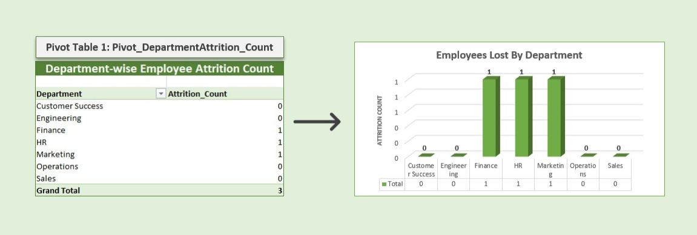
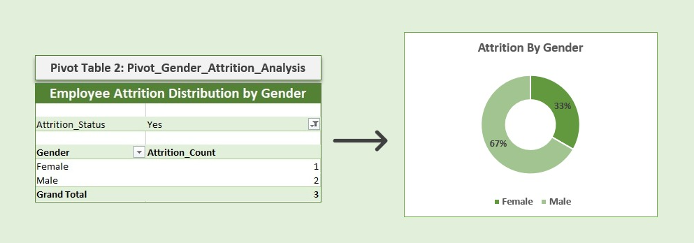
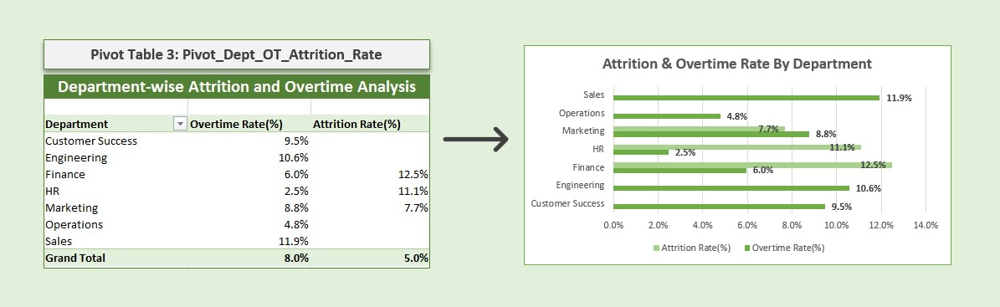
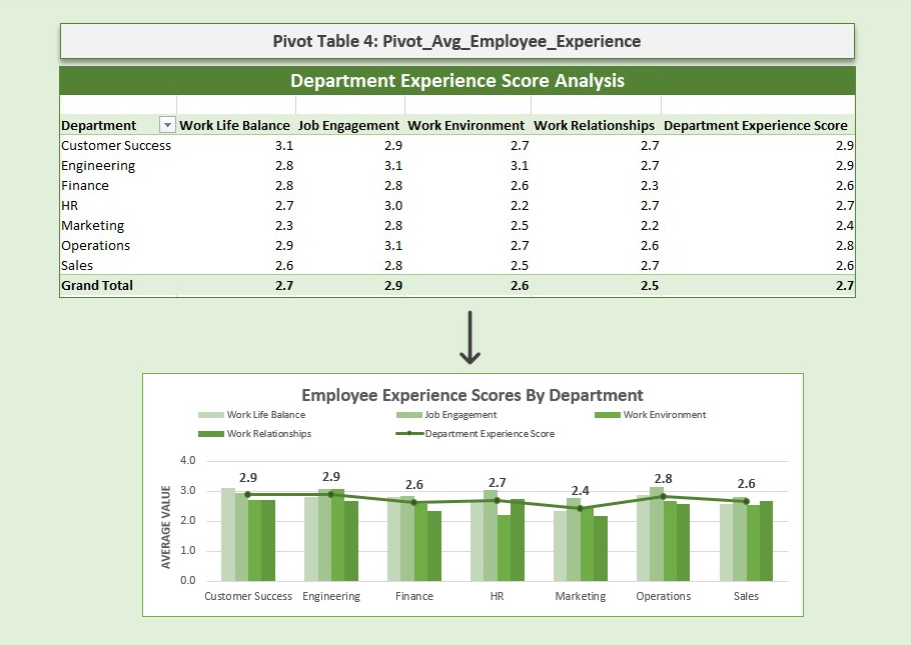
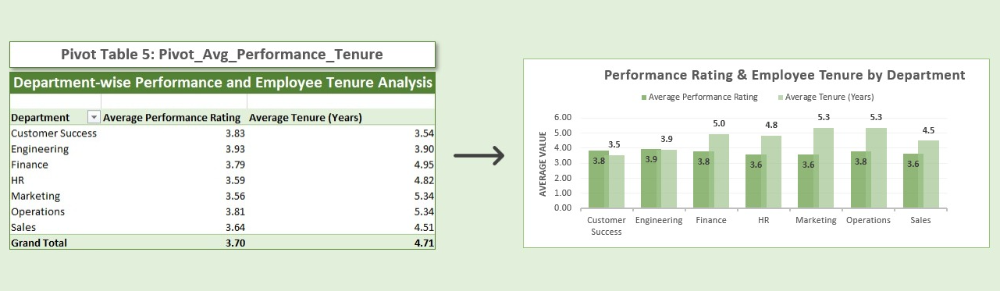
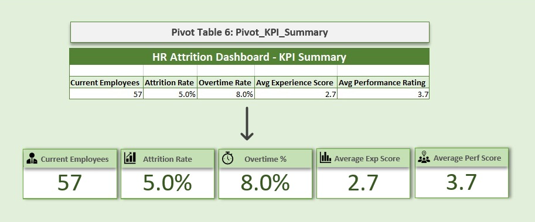
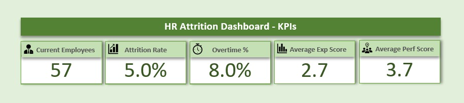
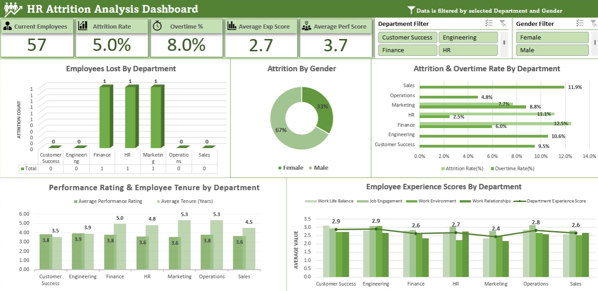
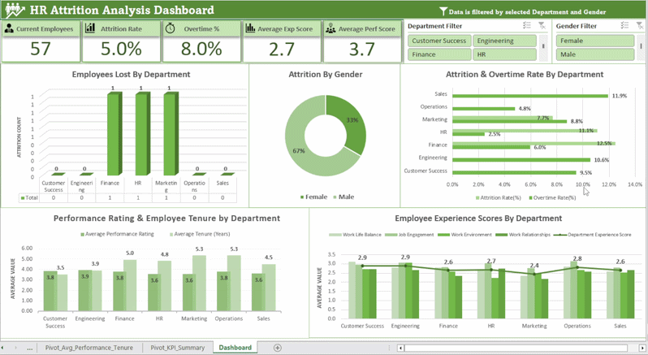

## 📊 HR Attrition Analysis Dashboard


---

## 🔷 Project Overview:

-  This project presents an interactive HR Attrition Analysis Dashboard built in Microsoft Excel using Power Pivot, DAX Measures, Pivot Tables, Pivot Charts, and Slicers.

-  The dashboard helps analyze employee attrition trends, workforce performance, employee experience, and overtime patterns across departments, enabling HR professionals to make data-driven decisions.


## 🔷 Business Objectives:

-  Employee attrition can significantly impact organizational productivity, employee morale, and recruitment costs.

-  This dashboard aims to answer key HR questions:

    - Which departments experience the highest attrition?
    - What is the employee exit rate by gender?
    - How does overtime relate to employee attrition?
    - How does employee experience affect employee exit?
    - How do employee performance and experience vary across departments?
    - What workforce trends can HR monitor using interactive filters?


---

## 🔷 Tools & Technologies:

-  Microsoft Excel
-  Power Pivot
-  DAX (Data Analysis Expressions)
-  Pivot Tables
-  Pivot Charts
-  Slicers
-  Data Modeling


---

## 🔷 Dataset Overview:

-  The project uses an HR Attrition dataset organized across 5 tables:

  - Fact_Attrition   :–  Employee attrition, overtime, tenure, and workforce-related data.
  - Dim_Employee     :–  Employee details.
  - Dim_Date         :–  Date information used for analysis.
  - Dim_Performance  :–  Employee performance ratings.
  - Dim_Satisfaction :–  Employee satisfaction and engagement metrics.


- Dataset Link:- [HR Attrition Dataset](https://github.com/Varunjha123/HR-DATA-ANALYSIS-DASHBOARD/blob/main/HR_Dataset/hr_attrition_raw_data.xlsx)

---

## 🔷 Analytics Workflow:

```text
Raw Data
    ↓
Data Cleaning
    ↓
Data Modeling
    ↓
Calculated Columns
    ↓
DAX Measures
    ↓
Pivot Tables & Charts
    ↓
Interactive Dashboard
```

## 🔷 Data Model:

-  The project follows a Power Pivot data model connecting employee, performance, satisfaction, date, and attrition data.


---

## 🔷 Calculated Columns:

- Custom calculated columns were created to enhance analysis and reporting.

1. Month(1)
-  Created in Dim_Date_1 table
-  Created to clean and standardize it as the original “month” field contained full date values instead of month names

2. Attrition_Count
-  Created in Fact_Attrition table
-  Converted Attrition_satisfaction column values into binary format (1 = Yes, 0 = No) to calculate total attrition easily in pivot tables and visuals.

3. Experience_Score
-  Created in Dim_Satisfaction table
-  Calculated as the average of four experience-related factors per employee to create a single score used for overall experience analysis through DAX measures


---

## 🔷 DAX Measures:

- Several DAX measures were created to support dynamic KPI calculations.

- Examples:

    - Current Employees
    - Attrition Count
    - Attrition Rate
    - Overtime Rate
    - Average Experience Score
    - Average Performance Rating


---

## 🔷 Pivot Tables:

The following Pivot Tables were created to support the dashboard visuals and KPI cards:

| Pivot Table Sheet | Dashboard Visual / Purpose |
|------------------|---------------------------|
| Pivot_DepartmentAttrition_Count | Employee Lost By Department |
| Pivot_Gender_Attrition_Analysis | Attrition By Gender |
| Pivot_Dept_OT_Attrition_Rate | Attrition & Overtime Rate By Department |
| Pivot_Avg_Employee_Experience | Employee Experience Scores By Department |
| Pivot_Avg_Performance_Tenure | Performance Rating & Employee Tenure By Department |
| Pivot_KPI_Summary | Source table for KPI cards |

### Pivot Tables Preview













---

## 🔷 KPI Summary:

- The KPI cards are powered by DAX measures and the Pivot_KPI_Summary table 
- The dashboard includes dynamic KPI cards that respond to slicer selections.

- ### KPIs

    -  Current Employees
    -  Attrition Rate
    -  Avg Experience Score
    -  Overtime %
    -  Avg Performance



---

## 🔷 Dashboard Preview:



---

## 🔷 Interactive Features:

- ### Filters

    - Department
    - Gender

- ### Visualizations

- Employees Lost by Department
- Attrition by Gender
- Attrition & Overtime by Department
- Performance Rating & Employee Tenure by Department
- Employee Experience Analysis by Department

All visuals and KPI cards update dynamically based on slicer selections.

---

## 🔷 Key Insights:

- The organization maintains a low attrition rate of 5.0%, with only 3 employee exits recorded.
- Attrition was concentrated in Finance, HR, and Marketing, departments that also reported below-average employee experience scores, suggesting workplace experience may be a key factor influencing employee retention.
- Overtime does not appear to be a primary driver of attrition, as Sales recorded the highest overtime rate while experiencing no employee exits.
- Employee performance remained consistently strong across departments despite moderate experience scores, indicating a productive workforce with opportunities to improve employee satisfaction.
- Lower ratings in Work Environment and Work Relationships emerged as potential areas for improvement to support long-term employee retention.

---

## 🔷 Dashboard Demo:

- A short dashboard walkthrough demonstrating KPI and chart interactivity is available below.

- **Demo:**

  

---

## 🔷 Interactive Dashboard:

- Download and explore the dashboard locally:

- **Dashboard Workbook:** [HR Attrition Dashboard.xlsx](Dashboard/hr_attrition_analysis_dashboard.xlsx)

---

## 🔷 Repository Structure:

```text

HR_Attrition_Analysis/
│
├── HR_Attrition_Dataset/
│   └── hr_attrition_raw_data.xlsx
│
├── Dashboard/
│   └── hr_attrition_analysis_dashboard.xlsx
│
├── Images/
│   ├── dashboard.png
│   ├── data_model.png
│   ├── calculated_columns.png
│   ├── data_measures.png
│   ├── kpi.png
│   ├── pivot_table1.png
│   ├── pivot_table2.png
│   ├── pivot_table3.png
│   ├── pivot_table4.png
│   ├── pivot_table5.png
│   └── pivot_table6.png
│
├── Videos/
│   └── dashboard_demo.gif
│
└── README.md

```

---

## 🔷 Skills Demonstrated:

- Data Cleaning
- Data Modeling
- Power Pivot
- DAX Calculations
- KPI Development
- Dashboard Design
- HR Analytics
- Data Visualization
- Business Insight Generation


---

## 🔷 Author:

**Varun Jha**

Data Analyst

Focused on building projects in:

- Excel
- SQL
- Python
- Power BI
- Data Analytics

---

## 🔷 Disclaimer: 

- This project uses a sample HR Attrition dataset for learning and portfolio purposes. The data does not represent real                     employees or a specific organization.

